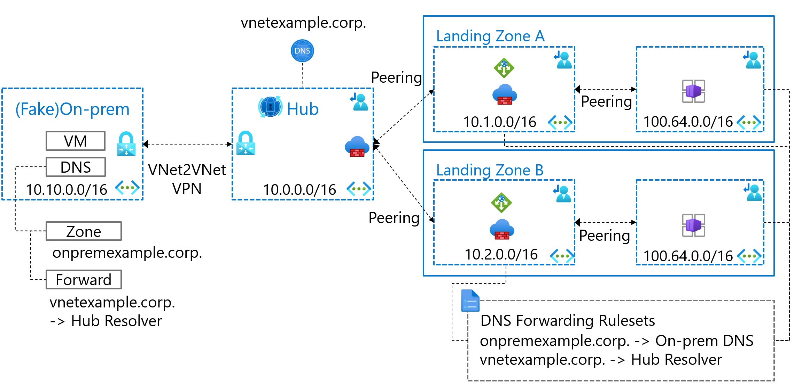

# Sample of Azure Container Apps on non-routable spoke VNet

## Background

 In some cases, it is difficult to assign a large address space in the enterprise network when using services that require a large address space such as Azure Container Apps. This sample divides the virtual network of the landing zone into routable and non-routable, and assigns a carrier-grade NAT address space (RFC 6598 - 100.64.0.0/10) to the non-routable side.

## Overview

The basic idea is based on the following article.

> [Prevent IPv4 exhaustion in Azure](https://learn.microsoft.com/en-us/azure/architecture/guide/networking/ipv4-exhaustion)

## Use cases

- On-premises to Landing Zones
- Landing Zone to Landing Zone
- Landing Zone to On-premises

## Notes

- Azure Firewall rules of this sample are only the minimum network rules required for SNAT. Add as needed.
- Source IP change due to SNAT of Azure Firewall. You [can insert](https://learn.microsoft.com/en-us/azure/firewall/rule-processing) the HTTP/HTTPS X-Forwarded-For header with the application rule of Azure Firewall.
- You need to check if Azure services are using the RFC 6598 address space. [Azure Container Apps uses](https://learn.microsoft.com/en-us/azure/container-apps/networking?tabs=azure-cli#subnet-address-range-restrictions) part of that address space, so this sample has been designed to exclude that range.
